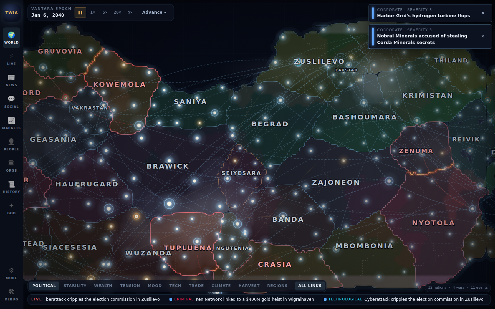
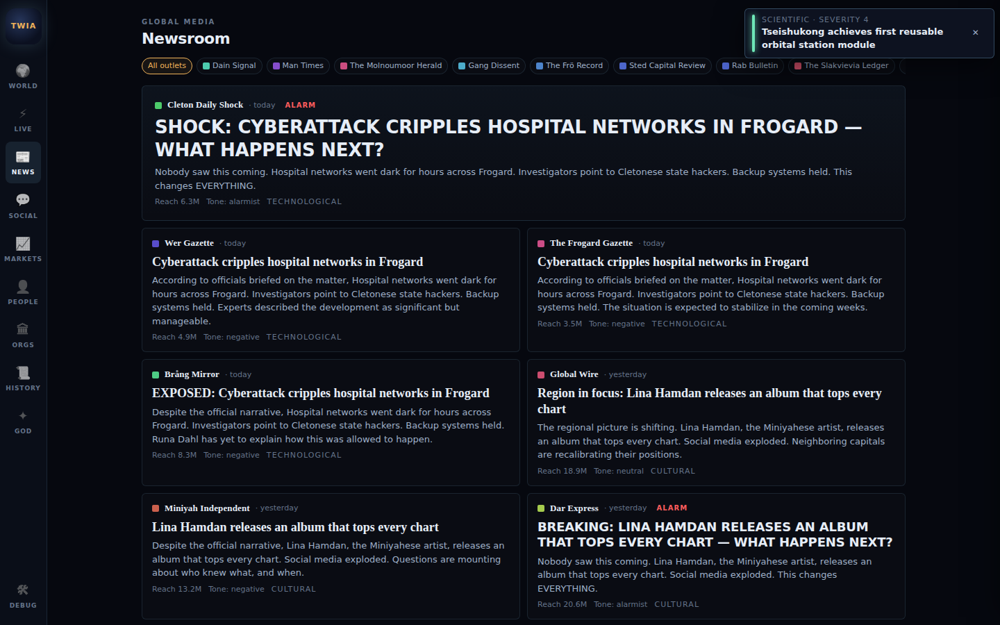
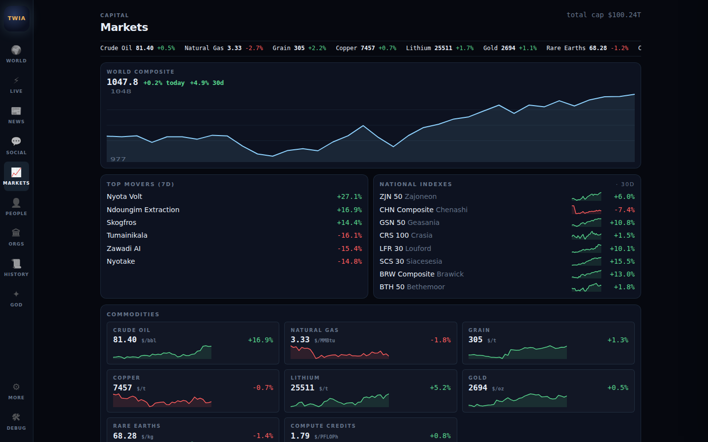
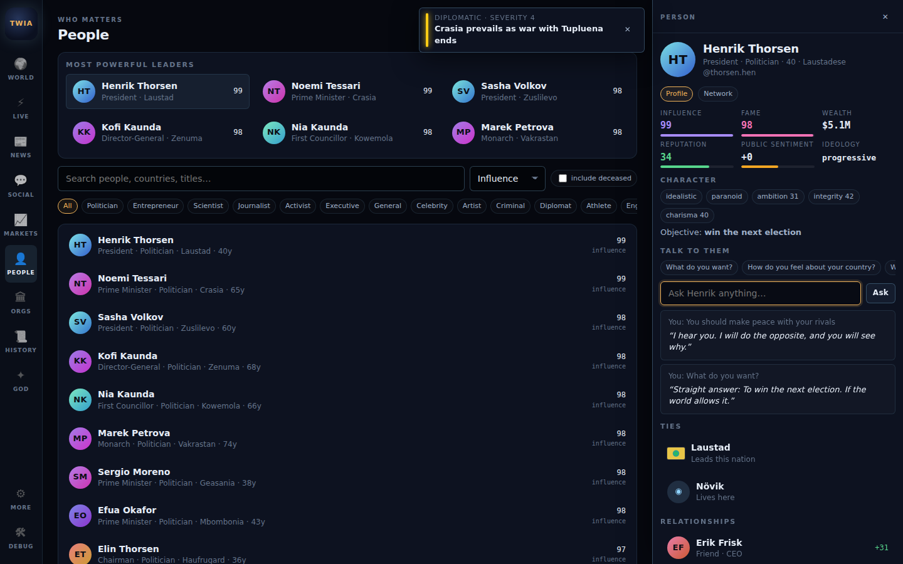

# THE WORLD IS ALIVE

A living, procedural civilization simulator that runs entirely in the browser.
Generate a world of nations, cities, leaders, companies, media outlets and citizens;
watch history emerge from their collisions; then intervene as a god and trace
what you caused.

- **Procedural**: every seed produces a different planet, borders, names, flags, economies, rivalries and a starting *premise* (The Cold Peace, The Long Boom, After the Plague, …) with its own opening storyline. The same seed reproduces the same starting world.
- **Simulated**: population, economy, politics, geopolitics, technology, society, environment and information systems influence each other every day.
- **Consequential**: every event can schedule follow-ups. Wars trigger refugee waves, market shocks, allied interventions and anti-war protests; breakthroughs reshuffle markets and geopolitics; scandals end careers, and rivals, allies, mentors and funders react to what happens to the people they know. Trade volumes tie economies together and the map shows burning war fronts. The Live screen tracks developing stories; History names the sagas and exports a Markdown chronicle.
- **Narrated**: a fictional media ecosystem covers events with different biases; a social feed reacts with characters that have personalities; markets move.
- **God Mode**: 40 preset interventions plus a freeform command box ("A small battery company discovers a battery that stores twenty times more energy…"), including delayed commands ("In 3 months, Ceria declares war on Slakevo") recorded as omens and carried out on the day.
- **Mobile-first**: bottom navigation, bottom-sheet inspector, pinch/zoom map, safe areas, installable PWA. Works offline once loaded.
- **Portable**: plain Vite + React + TypeScript. No backend, no API key required. Optional LLM hooks.

## Screenshots

Current build (v0.6): a Fractured Map world with four wars, burning fronts and trade arcs; the newsroom's weekly editorials; markets; a conversation with a leader; the intro with featured worlds. Regenerate with `npm run build && node tests/e2e/showcase.mjs`.

| | |
| --- | --- |
|  |  |
|  |  |

Mobile: [world map](docs/screenshots/world-mobile.png) · [God Mode cinematic](docs/screenshots/god-cinematic-mobile.png) · [intro with seed preview](docs/screenshots/intro-desktop.png)

Share a world: append `?seed=your-seed` to the URL (the 🔗 button copies it).

## Play it now (mobile-friendly)

**Live build (works now — githack mirror of the `gh-pages` branch; tap "Open the page" once if a prompt appears):** https://raw.githack.com/lvepelli/TheWorldIsAlive/gh-pages/index.html

**GitHub Pages URL:** https://lvepelli.github.io/TheWorldIsAlive/ — becomes active after a one-time click by the repository owner: *Settings → Pages → Build and deployment → Source: Deploy from a branch → Branch: `gh-pages` / (root) → Save*. (The Actions token cannot enable Pages by itself.) Every later push updates it automatically.

**Featured worlds (deep links, one per starting premise):** [The Cold Peace](https://raw.githack.com/lvepelli/TheWorldIsAlive/gh-pages/index.html?seed=amber-tide-6) · [The Long Boom](https://raw.githack.com/lvepelli/TheWorldIsAlive/gh-pages/index.html?seed=amber-harbor-16) · [The Age of Unrest](https://raw.githack.com/lvepelli/TheWorldIsAlive/gh-pages/index.html?seed=amber-summit-7) · [After the Plague](https://raw.githack.com/lvepelli/TheWorldIsAlive/gh-pages/index.html?seed=amber-meridian-2) · [The Machine Dawn](https://raw.githack.com/lvepelli/TheWorldIsAlive/gh-pages/index.html?seed=amber-orchard-13) · [The Fractured Map](https://raw.githack.com/lvepelli/TheWorldIsAlive/gh-pages/index.html?seed=amber-citadel-1) · [The Gilded Age](https://raw.githack.com/lvepelli/TheWorldIsAlive/gh-pages/index.html?seed=amber-lantern-2) · [The Quiet Century](https://raw.githack.com/lvepelli/TheWorldIsAlive/gh-pages/index.html?seed=amber-canyon-2). Any `?seed=` works; the intro shows the same eight as chips.

Open either URL in Safari (iPhone) or Chrome (Android). It is a static site over HTTPS, works offline after the first load, and can be installed to the home screen (Share → *Add to Home Screen* on iOS; the install banner or menu → *Add to Home screen* on Android). Deep links work: append `?seed=amber-tide-1234` to either URL.

Deployment is automatic: every push to the main development branch runs `.github/workflows/deploy.yml`, which tests, builds (path-relative), publishes `dist/` to the `gh-pages` branch, picks the live URL (Pages if enabled, else the mirror pinned to that deploy; see `docs/qa/LIVE_URL.txt`), then runs a Playwright QA pass against it on 360×800, 390×844, 430×932 and desktop viewports and commits the screenshots + `docs/qa/REPORT.md` back to the repo. To redeploy manually: *Actions → Deploy & QA → Run workflow*. A `netlify.toml` is included as well, so the repo can be connected to Netlify with one click if a second host is wanted. The latest QA report and screenshots from the live site are in [`docs/qa/`](docs/qa/REPORT.md).

## Quick start

```bash
npm install
npm run dev        # http://localhost:5173  (also reachable on your LAN for phone testing)
```

Other commands:

```bash
npm run build      # typecheck + production build into dist/
npm run preview    # serve the production build
npm test           # engine unit tests (vitest)
npm run e2e        # headless browser smoke test on desktop + mobile viewports (requires `npm run build` first)
DEPLOY_URL=https://lvepelli.github.io/TheWorldIsAlive/ node tests/e2e/deployed.mjs   # QA a deployed site (writes docs/qa)
node tests/e2e/serve.mjs 4173                                                         # serve dist/ locally with SPA fallback
npm run package    # zip the whole project (without node_modules/dist and the CI screenshots in docs/qa) → the-world-is-alive.zip (~3.5 MB)
node scripts/icons.mjs   # regenerate PNG icons from public/icons/icon.svg
```

Requirements: Node 20+ and npm. Playwright uses the system/bundled Chromium; set `CHROMIUM_PATH` if needed.

## How to play

1. **Generate** a world (or type a seed). Watch the initialization sequence and the reveal.
2. **Observe**: the map is the heart of the game. Tap a country or a glowing city to open the inspector. Switch map overlays (political, stability, wealth, tension, mood, tech).
3. **Advance time**: pause / 1× / 5× / 20× / fast-forward, or jump a day, week, month or year.
4. **Follow the world**: LIVE (event stream + daily summary), NEWS (outlets with bias), SOCIAL (posts, replies, trending), MARKETS (indexes, commodities, companies), PEOPLE, ORGS, HISTORY (timeline, your interventions, period summaries).
5. **Intervene**: GOD → describe what you want, or pick a preset. Then open the resulting event and read *Why did this happen?* to follow the causal chain as consequences unfold over the following days and months.
6. **Save**: autosaves every ~45 s of simulation and after interventions. Manual save/load, export to a `.json` file, import on any device.

Keyboard (desktop): `Space` pause/resume · `1–4` speeds · `G` God Mode · `W` world · `L` live · `Esc` close · `Shift+D` debug overlay.

## Project structure

```
index.html                  app shell (viewport, PWA meta)
public/                     manifest.webmanifest, sw.js (offline cache), icons/
src/
  main.tsx                  entry
  pwa.ts                    service-worker registration
  engine/                   pure TypeScript simulation, no React
    rng.ts                  seeded RNG + noise
    types.ts                data model (World, Country, Person, Company, Event …)
    names.ts                procedural naming (language families)
    time.ts, ids.ts
    generator/              geography.ts (continents, borders), world.ts (everything else), premise.ts (starting situations + featured seeds)
    simulation/             tick.ts (orchestrator), systems.ts, characters.ts, objectives.ts (goals → actions), markets.ts,
                            trade.ts, weather.ts, anniversaries.ts, information.ts (news/social/editorials), summary.ts, relations.ts
    events/                 engine.ts (createEvent/effects), actions.ts (world mutations),
                            spawn.ts (spontaneous events), consequences.ts (reaction rules)
    godmode/                presets.ts, interpreter.ts (freeform → plan), execute.ts
    ai/                     narrative.ts (local provider), llm.ts (optional), prompts.ts, index.ts
    persistence/            storage.ts (IndexedDB / memory, export/import, validation)
  state/                    store.ts (zustand), loop.ts (time loop)
  ui/                       App.tsx, Intro.tsx, Overlays.tsx, audio.ts, format.ts
    map/                    contours.ts, renderer.ts (canvas), WorldMap.tsx (input)
    screens/                World, Live, News, Social, Markets, People, Orgs, History, God, SaveManager
    components/             Inspector, EventCard, EntityRow, Flag, Avatar, Sparkline, RelationGraph, Modal, Stat
    styles/global.css       design system
prompts/                    LLM prompt templates (mirrored in src/engine/ai/prompts.ts)
tests/                      engine.test.ts (vitest), e2e/smoke.mjs (playwright)
scripts/                    package.mjs, icons.mjs
docs → *.md at repo root    ARCHITECTURE, GAME_DESIGN, WORLD_ENGINE, AI_SYSTEM, MOBILE, HANDOFF, CHANGELOG
```

## Documentation

- [ARCHITECTURE.md](ARCHITECTURE.md) — modules, state, rendering, data model, event flow, persistence
- [GAME_DESIGN.md](GAME_DESIGN.md) — player fantasy, loop, systems, God Mode, procedural generation
- [WORLD_ENGINE.md](WORLD_ENGINE.md) — simulation model, tick cadence, formulas, event and consequence rules
- [AI_SYSTEM.md](AI_SYSTEM.md) — local fallbacks, prompt locations, LLM integration, cost control
- [MOBILE.md](MOBILE.md) — responsive architecture, touch, PWA, Capacitor packaging
- [HANDOFF.md](HANDOFF.md) — **start here if you are continuing development**
- [CHANGELOG.md](CHANGELOG.md)

## Configuration

Copy `.env.example` to `.env`. Everything is optional. Setting `VITE_AI_ENDPOINT` enables LLM enhancement of top news stories and LLM interpretation of freeform God commands (with automatic local fallback).

## License

No license has been chosen yet by the project owner. All generated names, countries, people and events are fictional.
